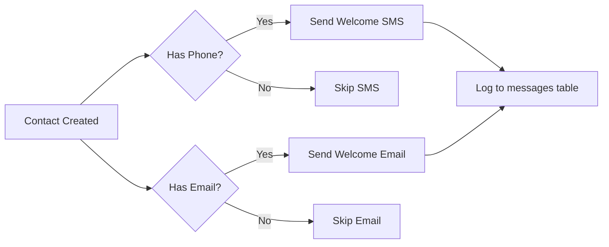

# Contacts Feature with Notifications — Implementation Complete ✅

## Overview
The CRM Contacts feature has been fully implemented with notification support, following the same patterns as Seekers, Ansars, and Partners.

---

## What Was Added

### 1. **Database & Backend** ✅
- **Schema**: `contacts` table in `convex/schema.ts`
- **CRUD Functions**: `convex/contacts.ts` with create, update, delete, and query operations
- **Notification Triggers**: Automatic SMS + Email when contacts are created

### 2. **Notifications System** ✅
Added to `convex/notifications.ts`:

#### Email Template
- **Welcome Email for Contacts** with role-specific greetings:
  - Imam: "Thank you for your leadership and guidance..."
  - Donor: "Your generosity helps us support new Muslims..."
  - Scholar: "Your knowledge and wisdom are invaluable..."
  - Volunteer: "Thank you for your willingness to serve..."
  - Community Member: "Welcome to the Ansar Family community..."
  - Family Member: "Thank you for being part of our extended family..."
  - Other: Generic welcome message

#### SMS Template
- **Welcome SMS for Contacts**: "Assalamu Alaikum {firstName}! You've been added to Ansar Family as a {role} 🤝"

#### New Actions
- `sendWelcomeContactSMS` - Sends SMS via Twilio
- `sendWelcomeContactEmail` - Sends email via Resend
- `sendWelcomeContact` - Wrapper that sends both (called automatically on contact creation)

### 3. **Partner Hub Dashboard** ✅
Location: `src/app/dashboard/[slug]/page.tsx`

- **Contacts Tab** with BookUser icon
- **Add Contact Modal** with full form
- **DataTable** showing Name, Phone, Role, City, Status
- **Detail Panel** with editable fields
- Contact count in Overview tab stats
- Organization-scoped (Partner Leads see only their contacts)

### 4. **Admin Dashboard** ✅
Location: `src/app/admin/page.tsx`

- Same Contacts tab, modal, table, and detail panel
- Admin sees **all contacts** across all organizations
- Contact count in Overview tab stats

---

## Contact Roles

The system supports 7 contact types:

| Role | Use Case | Example |
|------|----------|---------|
| **Imam** | Religious leaders | Masjid imam who can provide guidance |
| **Donor** | Financial supporters | Someone who supports the community financially |
| **Scholar** | Islamic scholars | Teachers or scholars who can provide knowledge |
| **Volunteer** | General volunteers | People who help with events/activities |
| **Community Member** | General contacts | Active community members |
| **Family Member** | Family of seekers/ansars | Parents, siblings, spouses |
| **Other** | Custom roles | Any other type of contact |

---

## Notification Flow

### When a Contact is Created:



### What Gets Sent:

**SMS** (if phone provided):
```
Assalamu Alaikum {FirstName}! You've been added to 
Ansar Family as a {Role} 🤝 We're honored to have 
you in our network. - Ansar Family

Reply STOP to opt out.
```

**Email** (if email provided):
- Personalized subject: "Welcome to Ansar Family, {FirstName} 🤝"
- Role-specific greeting
- Mission statement
- Community information (if part of an organization)
- Brand-consistent HTML design with Ansar Family colors

---

## Brand Colors Used

All notifications use the Ansar Family brand palette:

| Element | Color | Hex |
|---------|-------|-----|
| Primary (Sage) | Green | `#7D8B6A` |
| Seeker highlight | Light Sage | `#E8ECE4` |
| Ansar highlight | Terracotta | `#F5EAE6` |
| Partner highlight | Ochre | `#F5F0E4` |
| Background | Cream | `#F8F6F1` |
| Text | Charcoal | `#3D3D3D` |

---

## Testing

### Test the Contact Notifications:

1. **Add a Contact via Partner Dashboard:**
   - Go to `/dashboard/{slug}`
   - Click "Contacts" tab
   - Click "+ Add Contact"
   - Fill in name, role, phone, and email
   - Submit

2. **Add a Contact via Admin Dashboard:**
   - Go to `/admin`
   - Click "Contacts" tab
   - Click "+ Add Contact"
   - Fill in details
   - Submit

3. **Check Notifications:**
   - SMS: Check the phone number for welcome text
   - Email: Check inbox (and spam folder)
   - Audit: Check Convex dashboard → Data → `messages` table

### Troubleshooting:

**SMS not sending:**
- Verify Twilio env vars are set: `npx convex env list`
- On trial account: Phone must be in Verified Caller IDs
- Check `messages` table for error details

**Email not sending:**
- Verify Resend API key: `npx convex env list`
- Check domain is verified in Resend dashboard
- Check `messages` table for error details

---

## Database Schema

### contacts Table

```typescript
{
  fullName: string,              // Required
  email?: string,                // Optional
  phone?: string,                // Optional
  gender?: "male" | "female",   // Optional
  role: "imam" | "donor" | "community_member" | 
        "family_member" | "scholar" | "volunteer" | "other",
  roleOther?: string,            // For "other" role
  city?: string,
  stateRegion?: string,
  address?: string,
  organizationId?: Id<"organizations">,  // For org scoping
  tags: string[],                // Freeform labels
  notes?: string,
  status: "active" | "inactive"
}
```

### Indexes:
- `by_organization` - For org-scoped queries
- `by_status` - Filter by active/inactive
- `by_role` - Filter by role type
- `by_email` - Lookup by email

---

## Features Summary

✅ **Full CRUD** - Create, Read, Update, Delete contacts  
✅ **Organization Scoping** - Partner Leads see only their contacts  
✅ **Role Categorization** - 7 different contact types  
✅ **Search & Filter** - By name, email, phone, city, status  
✅ **Inline Editing** - Edit details in the detail panel  
✅ **Automatic Notifications** - SMS + Email on creation  
✅ **Audit Trail** - All messages logged to database  
✅ **Stats Tracking** - Contact counts in Overview tabs  
✅ **Brand Consistency** - Matches existing notification design  

---

## Next Steps (Optional Enhancements)

Consider adding:

1. **Bulk Import** - CSV upload for adding multiple contacts
2. **Contact Segmentation** - Filter by tags for targeted outreach
3. **Interaction History** - Log interactions with contacts
4. **Follow-up Reminders** - Scheduled notifications for follow-ups
5. **Contact Export** - Download contact list as CSV
6. **Advanced Search** - Search by tags, role, organization

---

## Files Modified

| File | Changes |
|------|---------|
| `convex/schema.ts` | Added `contacts` table |
| `convex/contacts.ts` | Created CRUD functions + notification triggers |
| `convex/notifications.ts` | Added contact email/SMS templates and actions |
| `src/app/dashboard/[slug]/page.tsx` | Added Contacts tab, modal, table, detail panel |
| `src/app/admin/page.tsx` | Added Contacts tab, modal, table, detail panel |

---

## Support

The Contacts feature is now fully integrated with your notification system. When contacts are added:
- They receive a welcome message (if phone/email provided)
- The message is role-specific and personalized
- All notifications are logged to the `messages` table
- The system follows the same patterns as Seekers, Ansars, and Partners

**Ready to use!** 🎉
